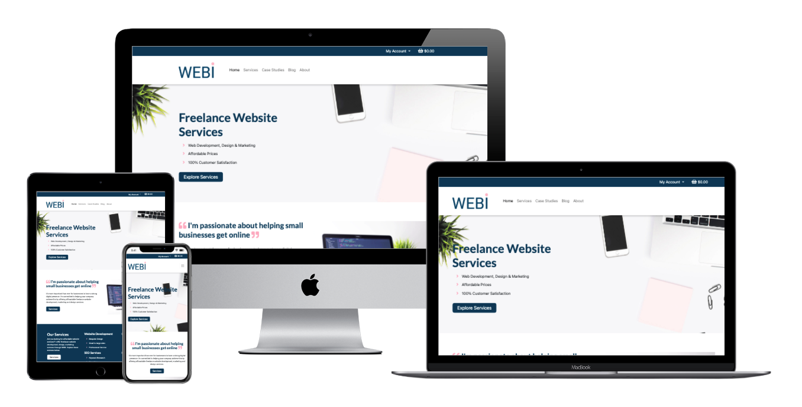
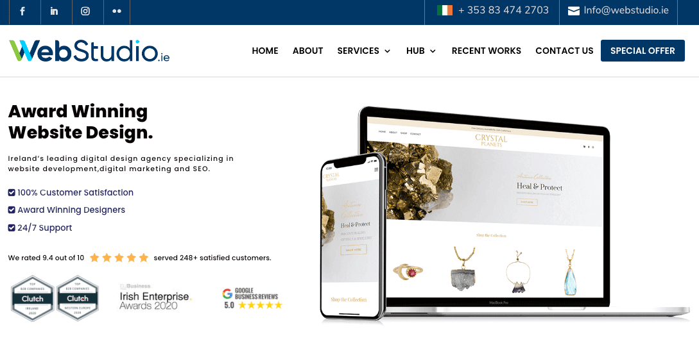

# WEBI

## Purpose

Welcome to WEBI - an e-commerce website where I offer my freelance marketing, design and web development services. I decided to create WEBI to help small businesses and startup companies, who often have a small budget, to avail of affordable website services.

WEBI is a multi-page e-commerce web application which not only offers services to its users, but also informative blog posts and case studies. Its initial vision was to offer website services which comprised of website 'Bundles' and 'Add-ons', but as the project evolved this led to simply an umbrella 'Services' offering. This evolution is mapped out further in the README document under the [Structural Evolution](#strucutral-evolution) section. 

**IMPORTANT: Please note, this project is for educational purposes only.**

Visit WEBI at [https://webi-development.herokuapp.com](https://webi-development.herokuapp.com/)

---

## Table of Contents

* [Purpose](#Purpose)
* [User Experience Design](#user-experience-design)
    * [User Stories](#user-stories)
    * [Design Inspiration](#design-inspiration)
    * [Colour Scheme](#colour-scheme)
    * [Typography](#typography)
    * [Logo](#logo)
* [Website Structure](#website-structure)
    * [Wireframes](#wireframes)
    * [Structural Evolution](#strucutral-evolution)
    * [Data Schema](#data-schema)
* [Features](#features)
    * [Existing Features](#existing-features)
    * [Features to be Implemented](#features-to-be-implemented)
* [Technologies Used](#technologies-used)
    * [Languages](#languages)
    * [Libraries and Frameworks](#libraries-and-frameworks)
    * [Tools](#tools)
* [Testing](#testing)
* [Deployment](#deployment)
    * [Project Creation](#project-creation)
    * [Heroku Deployment](#heroku-deployment)
    * [Local Deployment](#local-deployment)
    * [Hosting Files via AWS](#hosting-files-via-aws)
    * [Sending Emails Through Gmail](#sending-emails-through-gmail)
* [Credits](#credits)
    * Code
    * [Acknowledgements](#acknowledgements)

--- 

## User Experience Design

### User Stories

| USER STORY ID                  | AS A       | I WANT TO BE ABLE TO                                        | SO THAT I CAN                                                                 |
|--------------------------------|------------|-------------------------------------------------------------|-------------------------------------------------------------------------------|
| **Viewing and Navigation**         |            |                                                             |                                                                               |
| 1                              | Prospect   | View a list of services available                 | Select a service to buy                                              |
| 2                              | Prospect   | View specific types of services                        | Easily find a service suited to my needs                                      |
| 3                              | Prospect   | View individual service details                             | Identify the service price, description and suitability                       |
| 4                              | Prospect   | Easily view the total of my purchases                       | Ensure total cost falls within my budget                                      |
| 5                              | Prospect   | Read blogs                                                  | Expand my knowledge on design and development                                 |
| 6                              | Prospect   | Review case studies                                         | Trust the quality of the freelancing services on offer                        |
| **Registration and User Accounts** |            |                                                             |                                                                               |
| 7                              | Client     | Easily register for an account                              | Setup my own personal area on the website to see my order history and profile |
| 8                              | Client     | Easily login or logout                                      | Access my personal account information                                        |
| 9                              | Client     | Easily recover my password if I forget it                   | Recover access to my account                                                  |
| 10                             | Client     | Receive an email confirmation after registering             | Verify that my account registration was successful                            |
| 11                             | Client     | Have a personalised user profile                            | View my personal order history and progress                                   |
| **Sorting and Searching**          |            |                                                             |                                                                               |
| 12                             | Prospect   | Sort the list of all available services                     | Quickly find a service that meets my requirements                             |
| 13                             | Prospect   | Sort services by a specific type                        | Narrow down services to those of interest                                     |
| **Purchasing and Checkout**        |            |                                                             |                                                                               |
| 14                             | Prospect   | View items in my bag to be purchased                        | See what the total cost of items in my basket are                             |
| 15                             | Prospect   | Adjust the quantity of individual items in my bag           | Make changes to items in my basket before checking out                        |
| 16                             | Prospect   | Easily enter my payment information                         | Purchase my desired services                                                  |
| 17                             | Prospect   | Feel my personal and payment information is safe and secure | Feel comfortable in providing my payment information to make a purchase       |
| 18                             | Prospect   | View my order confirmation after checkout                   | Ensure I have made the correct purchase                                       |
| 19                             | Prospect   | View the progress of my order                               | I know when I can expect it to be ready                                       |
| **Admin and Store Owner**     |            |                                                             |                                                                               |
| 20                             | Admin/ Store Owner | Add a service                                      | Add new items to my store                                                     |
| 21                             | Admin/ Store Owner | Edit/update a service                              | Ammend service/ product decriptions, price and images                         |
| 22                             | Admin/ Store Owner | Delete a service                                            | Remove any services which are no longer being sold                            |
| 23                             | Admin/ Store Owner | Edit/ update the status of an order                         | Update clients of their order progress                                        |

### Design Inspiration

Before designing this website, I explored similar sites online to get an idea of the look and feel of websites in the industry. One company which really stood out to me was <a href="https://www.webstudio.ie/" target="_blank">WebStudio</a>. I drew great inpsiration from this website both strucutrally for my database and design-wise. 

### Colour Scheme

I researched colour schemes on Google and used Adobe's colour picker to choose the blue and pink shades for this website. I selected blue to represent professionalism and pink to show creativity and a nice contrast to the blue. Their Hexadecimal values are listed below:

| Colour | Hex Value |
| ------ | ------ |
| Blue | #093d60 |
| Pink | #feb5c5 |

### Typography
The fonts chosen for this website are Lato for headings and Roboto for the paragraph text. These are both sans serif fonts and I imported them into the CSS file from [Google Fonts](https://fonts.google.com/).

### Logo
I created the logo using Adobe Illustrator. I wanted a modern, clean and sans serif font for the logo and decided on Roboto Regular for this. The colours chosen were a combination of the blue and pink listed in the colour scheme above. The image below demonstrates how the logo should be used against dark and light backgrounds:

[Back to top](#webi)

---

## Website Structure

### Wireframes

I created wireframes for this web application using balsamiq:

| Desktop Wireframes | Mobile Wireframes | Tablet Wireframes |
|--------------------|-------------------|-------------------|
| [Homepage](readme-files/wireframes/homepage-desktop.png) | [Homepage](readme-files/wireframes/homepage-mobile.png) | [Homepage](readme-files/wireframes/homepage-tablet.png) |
| [Bundles](readme-files/wireframes/bundles-desktop.png) | [Bundles](readme-files/wireframes/bundles-mobile.png)| [Bundles](readme-files/wireframes/bundles-tablet.png) |
| [Add-ons](readme-files/wireframes/addons-desktop.png) | [Add-ons](readme-files/wireframes/addons-mobile.png) | [Add-ons](readme-files/wireframes/addons-tablet.png) |
| [About](readme-files/wireframes/about-desktop.png) | [About](readme-files/wireframes/about-mobile.png) | [About](readme-files/wireframes/about-tablet.png) |
| [Blog](readme-files/wireframes/blog-desktop.png) | [Blog](readme-files/wireframes/blog-mobile.png) | [Blog](readme-files/wireframes/blog-tablet.png)  |

### Strucutral Evolution

From the wireframes above, you can see that WEBI originally started out selling both 'Bundles' and 'Add-ons' to potential customers. Bundles offered a collection of Add-ons to purchase as a package. 

These Bundles consisted of services such as an E-commerce store Bundle, a Static store Bundle and a Portolio Bundle. This meant that business owners who did not have a website, could purchase a package which delivered a website build, design, website pages etc. The Add-ons were additional services which could be included as part of a Bundle, or separately, if users required something more e.g. a logo design or a landing page etc.

The initial build of this website was setup to include the above and this can be demonstrated by the wireframes created and the models listed below under the 'Services App'. However, setting up the website bag, checkout and Stripe payments to house two separate Services models made for a complex build. Given the time constraints to launch the initial build of the web app, a decision was made to narrow the scope down into one Services model.

The new Services model does not offer the user Bundles, however users are free to purchase as many services as they wish to make up their own package. The result of this was a more straightforward website build and it ensured it was completed within the time constraints. Furthermore, the design of the new Services model closely matches that on the initial 'Add-ons' page and thus a new wireframe was not created for this. 

### Data Schema

#### Current Services App

**Type Model**

| Name | Database Key | Field Type | Type Validation |
|------|--------------|------------|-----------------|
| name | Name         | CharField  | max_length=254  |

**Category Model**

| Name          | Database Key  | Field Type | Type Validation                       |
|---------------|---------------|------------|---------------------------------------|
| Name          | name          | CharField  | max_length=254                        |
| Friendly Name | friendly_name | CharField  | max_length=254, null=True, blank=True |

**Images Model**

| Name      | Database Key | Field Type | Type Validation                        |
|-----------|--------------|------------|----------------------------------------|
| name      | Name         | CharField  | max_length=254                         |
| Image     | image        | ImageField | null=True, blank=True                  |
| Image URL | image_url    | URLField   | max_length=1024, null=True, blank=True |

**Services Model**

| Name        | Database Key | Field Type            | Type Validation                                  |
|-------------|--------------|-----------------------|--------------------------------------------------|
| Category    | category     | ForeignKey 'Category' | null=True, blank=True, on_delete=models.SET_NULL |
| Type        | type         | ForeignKey 'Type'     | null=True, blank=True, on_delete=models.SET_NULL |
| Name        | name         | CharField             | max_length=254                                   |
| Description | description  | RichTextField         | n/a                                              |
| Price       | price        | DecimalField          | max_digits=6, decimal_places=2                   |
| Image       | image        | ForeignKey 'Image'    | null=True, blank=True, on_delete=models.SET_NULL |

#### OLD Services App Models

**Bundle Model**
| Name        | Database Key | Field Type            | Type Validation                                  |
|-------------|--------------|-----------------------|--------------------------------------------------|
| Category    | category     | ForeignKey 'Category' | null=True, blank=True, on_delete=models.SET_NULL |
| Service ID  | service_id   | CharField             | max_length=254, null=True, blank=True            |
| Name        | name         | CharField             | max_length=254                                   |
| Description | description  | RichTextField         | max_length=350                                   |
| Price       | price        | DecimalField          | max_digits=6, decimal_places=2                   |

**Addon Model**
| Name        | Database Key | Field Type            | Type Validation                                  |
|-------------|--------------|-----------------------|--------------------------------------------------|
| Category    | category     | ForeignKey 'Category' | null=True, blank=True, on_delete=models.SET_NULL |
| Add-on ID   | addon_id     | CharField             | max_length=254, null=True, blank=True            |
| Name        | name         | CharField             | max_length=254                                   |
| Description | description  | RichTextField         | max_length=350                                   |
| Price       | price        | DecimalField          | max_digits=6, decimal_places=2                   |

#### Checkout App

**Order Model**

| Name             | Database Key    | Field Type               | Type Validation                                                         |
|------------------|-----------------|--------------------------|-------------------------------------------------------------------------|
| Order Number     | order_number    | CharField                | max_length=32, null=False, editable=False                               |
| User Profile     | user_profile    | ForeignKey 'UserProfile' | on_delete=models.SET_NULL, null=True, blank=True, related_name='orders' |
| Full Name        | full_name       | CharField                | max_length=50, null=False, blank=False                                  |
| Email            | email           | EmailField               | max_length=254, null=False, blank=False                                 |
| Phone Number     | phone_number    | CharField                | max_length=20, null=False, blank=False                                  |
| Country          | country         | CountryField             | blank_label='Country *', null=False, blank=False                        |
| Postcode         | postcode        | CharField                | max_length=20, null=True, blank=True                                    |
| Town or City     | town_or_city    | CharField                | max_length=40, null=False, blank=False                                  |
| Street Address 1 | street_address1 | CharField                | max_length=80, null=False, blank=False                                  |
| Street Address 2 | street_address2 | CharField                | max_length=80, null=True, blank=True                                    |
| County           | county          | CharField                | max_length=80, null=True, blank=True                                    |
| Date             | date            | DateTimeField            | auto_now_add=True                                                       |
| Order Total      | order_total     | DecimalField             | max_digits=10, decimal_places=2, null=False, default=0                  |
| Grand Total      | grand_total     | DecimalField             | max_digits=10, decimal_places=2, null=False, default=0                  |
| Original Bag     | original_bag    | TextField                | null=False, blank=False, default=''                                     |
| Stripe PID       | stripe_pid      | CharField                | max_length=254, null=False, blank=False, default=''                     |

**OrderLineItem Model**

| Name            | Database Key   | Field Type           | Type Validation                                                             |
|-----------------|----------------|----------------------|-----------------------------------------------------------------------------|
| Order           | order          | ForeignKey 'Order'   | null=False, blank=False, on_delete=models.CASCADE, related_name='lineitems' |
| Service         | services       | ForeignKey 'Service' | null=False, blank=False, on_delete=models.CASCADE                           |
| Quantity        | quantity       | IntegerField         | null=False, blank=False, default=0                                          |
| Line Item Total | lineitem_total | DecimalField         | max_digits=6, decimal_places=2, null=False, blank=False, editable=False     |

#### Case Study App

**Case Study Model**

| Name               | Database Key       | Field Type    | Type Validation                        |
|--------------------|--------------------|---------------|----------------------------------------|
| Title              | title              | CharField     | max_length=50                          |
| slug               | slug               | SlugField     | max_length=200, unique=True            |
| Image              | image              | ImageField    | null=True, blank=True                  |
| Image URL          | image_url          | URLField      | max_length=1024, null=True, blank=True |
| Featured           | featured           | BooleanField  | default=False                          |
| Website URL        | webite_url         | URLField      | max_length=1024                        |
| GitHub URL         | github_url         | URLField      | max_length=1024                        |
| Heading            | heading            | CharField     | max_length=200, default='Heading'      |
| Case Study Content | case_study_content | RichTextField | default='Case study content'           |

#### Blog App

**Blog Model**

| Name           | Database Key   | Field Type    | Type Validation                        |
|----------------|----------------|---------------|----------------------------------------|
| Title          | title          | CharField     | max_length=50                          |
| slug           | slug           | SlugField     | max_length=200, unique=True            |
| Blog Image     | blog_image     | ImageField    | null=True, blank=True                  |
| Blog Image URL | blog_image_url | URLField      | max_length=1024, null=True, blank=True |
| Heading        | heading        | CharField     | max_length=200                         |
| Published Date | published_date | DateField     | max_length=200                         |
| Blog Content   | blog_content   | RichTextField | default='Blog content'                 |

[Back to top](#webi)

--- 

## Features

In this section I will map out all of the existing features, and features left to be implemented, and match these with the [User Stories](#user-stories) previously outlined above. 

### Existing Features

#### Viewing and Navigation

**[User Story ID's 1-6]**

* WEBI provides users a multi-page site with an intuitive design which allows users to navigate smoothly between pages
* On the Services page, users are presented with a clear list of service types to choose from at the start so they can filter the results to match their needs or view all
* Users can click to 'find out more' about a service of interest which brings them to a more detailed service description page
* On the main navigation menu, users can go to the Blog or Case Studies page which display a list of available blogs and case studies to read
* On the Blog and Case Studies pages, users can click to read more to get the full length version of the posts
* Users can easily view the total of their purchases in their bag or on the navigation menu in the top right beside the basket icon

#### Registration and User Accounts
**[User Story ID's 7-11]**

* Users can easily navigate to register for an account via the drop down 'My Account' menu
* For users with an existing account, they can sign in via the drop down 'My Account' menu and once signed in, a Sign Out button will appear for them in the dropdown menu also
* Users will receive notifications upon sucessfully signing in and signing out
* Logged in users will have access to a personal profile which displays their order history

Due to time constraints, User Story ID 9 and 10 were not implemented and the 'progress' part of User ID 11; however, they have been moved to the upcoming Features To Be Added below.

#### Sorting and Searching
**[User Story ID's 12-13]**
* Users are able to filter the category 'Service' by Type on the Services page
* Users are presented with a clear list of service types to choose from at the start so they can filter the results to match their needs or view all
* Users can change between different filter options to see the available services for that specific filter

User story 13 no longer applies as the website is not devided into Bundles and Addons. Instead Services is the only category which can be narrowed down by type.

#### Purchasing and Checkout
**[User Story ID's 14-19]**
* Users can easily access their bag by clicking on the basket icon in the top right corner on the navigation menu
* Users are presented with a view of all of the services they've added to their basket on the bag page
* Users can easily add or delete the services in their bag by clicking on the -/+ icons
* When users have finished a purchase, they are presented with a clear overview of their order afterwards
* The 'Secure Checkout' button ensures that users feel comfortable to provide payment information

Due to time constraints, User Story ID 19 was not implemented. This has been included in the upcoming Features To Be Added below.

#### Admin and Store Owner
**[User Story ID's 20-23]**
* The store owner or admin can easily edit, add or remove an existing service from the store by navigating to the 'Service Management' page in the 'My Account' drop down menu
* Super Admins can edit the store via the Admin panel

Due to time constraints, User Story ID 23 was not implemented. This has been included in the upcoming Features To Be Added below.

### Features Left To Be Implemented

* Send users a personalised email after completing the registrationg process
* Allow users to see the progress of their order
* Provide Admins/ Store Owners with the funcitonality to edit/update the status of an order
* Implement website Bundles/ Packages to group related services for the user
* Improve Services Management functionality to allow admins to upload a new service image and format the text (e.g. bold text & bullet points)

**Styling Fixes**
Below I have outlined the styling fixes which are still to be implemented in a future udpate:
* The 'Description' box on the Services Management page for Admin users is appearing lesser in width than the other form input fields. A fix couldn't be found for this minor issue prior to the app launch and will be addressed in a future release
* Wrap text around blog post images
* Implement JavaScript on the nav bar to update the text to bold when users change page location
* Implement JavaScript on the services filter menu so it changes colour when users change between service types

[Back to top](#webi)

--- 

## Testing

The testing of this website can be found in the [TESTING.md file](TESTING.md).

[Back to top](#webi)

--- 

## Technologies Used

### Languages
* [HTML](https://en.wikipedia.org/wiki/HTML) was the main language used to create this website
* [CSS](https://en.wikipedia.org/wiki/CSS) was used to add bespoke design
* [JavaScript](https://en.wikipedia.org/wiki/JavaScript) was used to create interactive elements on the website
* [Python](https://www.python.org/) was used for the backend of the website

### Libraries and Frameworks
* [Django](https://www.djangoproject.com/) was used as the Python-based web framework
* [Bootstrap](https://getbootstrap.com/) was used as the front-end framework
* [Google Fonts](https://fonts.google.com/) was used to find, sample and import fonts for the logo and website
* [Font Awesome](https://fontawesome.com/) was used for icons across the website
* [CKEditor](https://ckeditor.com/) was used to set up a Rich Text Editor in the Heroku admin panel

### Tools
* [Git](https://git-scm.com/) was used as the version control software to add, commit and push code to the GitHub repository
* [Gitpod](https://gitpod.io/) was used as the development environment to write my code
* [GitHub](https://github.com/) is the hosting site used to store the source code for the Website
* [Heroku](https://dashboard.heroku.com/) was used to run the application in the cloud
* [W3C Markup validator](https://validator.w3.org/) was used regularly to check for any errors in the HTML on the site
* [W3C CSS validator](https://jigsaw.w3.org/css-validator/) was used regularly to check for any errors in the CSS on the site
* [Web Accessibility](https://www.webaccessibility.com/) was used to test the website's accessibility to people with disabilities
* [Adobe Illustrator](https://www.adobe.com/ie/products/illustrator.html) was used to create the logo and high fidelity mock ups
* [TinyPNG](https://tinypng.com/) was used to reduce the size of all the images on the website
* [balsamiq](https://balsamiq.com/wireframes/) was used to create low-fidelity wireframes of the website
* [JSHint](https://jshint.com/) was used to test the JavaScript code for errors
* [PEP8 Online](http://pep8online.com/) was used to check for PEP8 compliance
* [TableConvert](https://tableconvert.com/) was used to convert csv data to markdown tables
* [Temp mail](https://temp-mail.org/en/) was used to create a temporary email address to test the sign up page
* [AWS](https://s3.console.aws.amazon.com/) was used to host static files
* [STRIPE](https://stripe.com/ie) was used to setup the website payment functionality
* [Gmail](https://gmail.com) was used to send emails with Django

[Back to top](#webi)

--- 

## Deployment

### Project Creation
This project was created on GitHub using the following steps:

1. On Github, a new repository named ‘webi’ was created by navigating to ‘New’ on the Repositories page, selecting the CI full template, providing a ‘Repository name’, ‘Description’ and then clicking ‘Create repository’
2. Once the repository was created, I clicked the ‘Gitpod’ button to create the workspace in Gitpod
3. Version control was used throughout the project using the following commands: git commit -m "descriptive updates" - This command was used to commit changes to the local repository
4. git push - This command was used to push all committed changes to the GitHub repository

A new Django project was created as follows:

1. In the terminal, type ‘pip3 install django’ to install Django from the Python package index (version 3) and install in Gitpod
2. To create the project in the current directory, type ‘django-admin startproject webi .’ in the terminal
3. A .gitignore was created by typing ‘touch .gitignore’ in the terminal (included in CI template) which excluded our development database file (*.sqlite3) and compiled Python code (*.pyc and __pycache__) we don’t need in version control
4. Test Django is installed correctly by typing ‘python3 manage.py runserver’ in the terminal
5. Run the initial migrations by typing ‘python3 manage.py migrate’ in the terminal

A super user was created as follows:
1. Type ‘python3 manage.py createsuperuser’ in the terminal
2. Set a username, email address and password

In Django a SECRET_KEY is automatically included in the settings.py file. This was removed after the initial commit as follows:
1. Find a Django Secret Key generator online and copy SECRET_KEY
2. Set the secret key in the environment variable
3. Check the server still runs
4. Push to GitHub

### Local Deployment

The following steps are required to run this locally:

1. Go to the GitHub repository
2. Click the 'Code' dropdown menu
3. Copy Git URL from HTTPS box (https://github.com/JessicaJuliet/webi.git), or select to download the ZIP file
4. If usings the Git URL, open a new terminal in your IDE and type the 'git clone' command in the CLI and paste the copied URL
5. A clone of this project will be created locally on your machine
6. Alternatively, if you download the ZIP, unpackage locally and open in your IDE

### Heroku Deployment
1. Create Heroku App
    * Go to Heroku.com
    * Click to create new app
    * Name the app and select region closest to you
    * Then on the Resources tab, provision a new 'Heroku Postgress' database
    * In Gitpod, install dj_database_url and psycopg_2 using the following commands:

    > pip3 install dj_database_url

    > pip3 install psycopg2-binary

    * Freeze requirements to ensure Heroku installs all our app requirements when deployed:
    > pip3 freeze > requirements.txt

2. Setup Database
    * Import dj_database_url in settings.py

    > import dj_database_url

    * Comment out the default Database configuration in settings.py and replace with a call to dj_database_url with the database URL from Heroku (can retrieve from Heroku settings tab)

    > DATABASES = {
        'default': dj_database_url.parse('postgress_url')
    }

    * Run migrations:
    > pythong3 manage.py migrate
    * Import service data
    > python3 manage.py loaddata categories
    > python3 manage.py loaddata types
    > python3 manage.py loaddata images
    > python3 manage.py loaddata services
    * Remove Heroku database config before committing

3. Create a superuser
* To create a super user to log in with use:

> python3 manage.py createsuperuser

4. Commit changes
* Remove Heroku database config and uncomment original so the Database URL doesn't end up in version control
* Commit changes"
> git add .
> git commit -m "commit message"
> git push

### Hosting Files Via AWS

In order to host static files and images with AWS, you will need to create an AWS account. After that, you are required to create the following in AWS: 

* AWS S3 Bucket
* Bucket Policy
* Group Access Policy
* A User

Further information on this process can be found on [Amazon AWS](https://docs.aws.amazon.com/AmazonS3/latest/userguide/GetStartedWithS3.html). After the above has been completed, you are required to connect Django to S3. More detailed information on connecting Django to S3 can be found [here](https://django-storages.readthedocs.io/en/latest/backends/amazon-S3.html).

### Sending Emails Through Gmail

Sending automatic emails with Django was carried out using the following steps:

1. Setup a Gmail account (or use an existing one if you already have one)
2. Login to your account and go to the account settings
3. Click 'Accounts and Import' and then 'Other Google Account Settings'
4. Navigate to the Security tab and turn on 2-step verification
5. Select a verification method
6. Go to 'App Passwords' under the 'Signing in to Google' heading
7. Select 'Mail' for the app and select 'Other' for device type and type in Django
8. Copy the 16 character password in Heroku 
9. Navigate to Heroku and put it under EMAIL_HOST_PASS config variable
10. Then, put the Gmail e-mail under the EMAIL_HOST_USER config var

[Back to top](#webi)

--- 

## Credits

### Code

* Django CKEditor:
    * [Stack Overflow](https://stackoverflow.com/questions/34149541/is-there-any-way-to-change-the-default-text-editor-for-textfield-django-in-admin)
    * [Github Django CKEditor](https://github.com/django-ckeditor/django-ckeditor)
* Bootstrap Navbar - https://getbootstrap.com/docs/4.0/components/navbar/
* CSS box shadows - https://getcssscan.com/css-box-shadow-examples
* The Code Institute's 'Boutique Ado' run through project helped to guide this project's code

### Acknowledgements

* A huge thank you to my mentor Simen for his support, encouragement and motivation which he provided me with throughout this entire project
* Thank you to the Code Institute's mentors for helping me to resolve some of the most complicated bugs
* Thank you to all of the supportive members of the Code Institute's Slack channel who helped me when the bugs got tough!

[Back to top](#webi)
