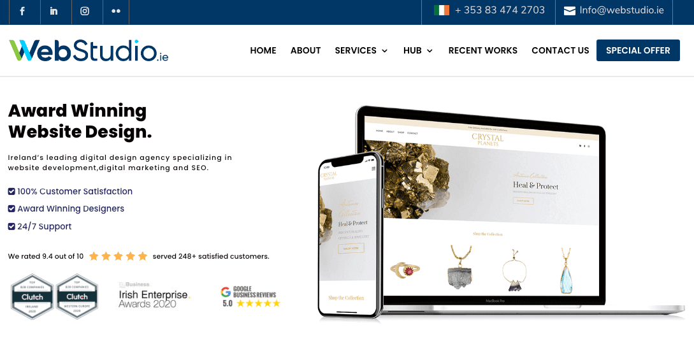
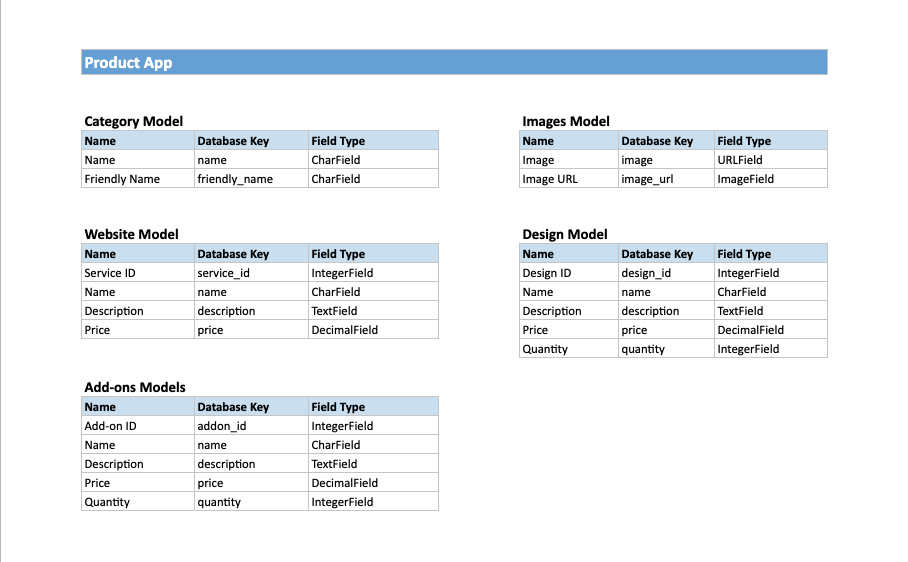
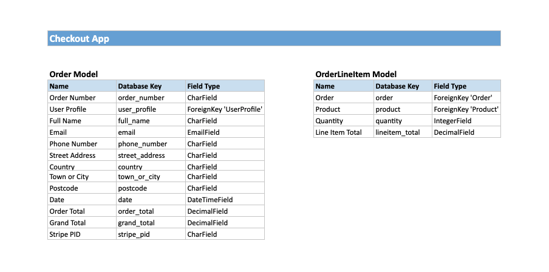
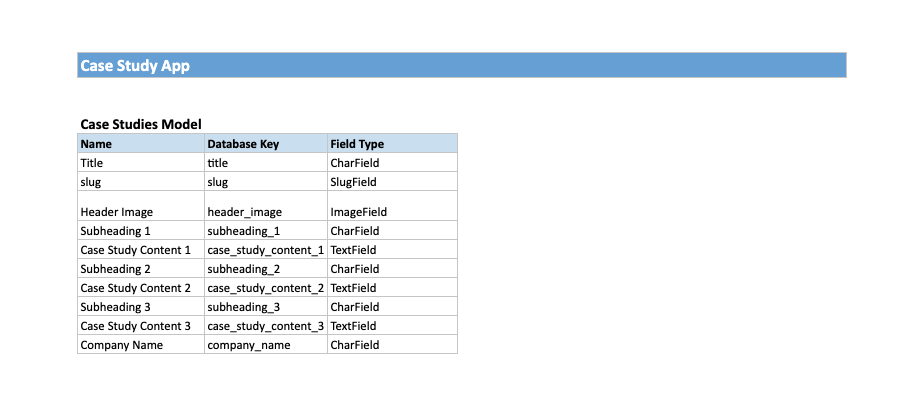

# WEBI

## Purpose
### Introduction

**WEBI** is a website design and development agency. It offers affordable website packages aimed at small businesses and start up companies who wish to build a professional face for their company online. 

WEBI's services also span beyond design and development and include marketing services, such as SEO management, to ensure its client's websites are discoverable online and reach the right audience, in addition to hosting services. 

WEBI's affordable prices help the company to stand out in a competitive market and attract its target audience outlined above which often have a small budget for website projects.

## Table of Contents

* [Purpose](#Purpose)
    * [Introduction](#Introduction)
* [User Experience Design](#user-experience-design)
    * [User Stories](#user-stories)
    * [Design Inspiration](#design-inspiration)
    * [Colour Scheme](#colour-scheme)
    * [Typography](#typography)
    * [Logo](#logo)
* [Website Structure](#website-structure)
    * [Wireframes](#wireframes)
    * [Mockups](#mockups])
    * [Data Schema](#data-schema)
* Features
    * Existing Features
    * Features to be Implemented
* [Technologies Used](#technologies-used)
    * [Languages](#languages)
    * [Libraries and Frameworks](#libraries-and-frameworks)
    * [Tools](#tools)
* Testing
* [Deployment](#deployment)
    * [Project Creation](#project-creation)
    * Heroku Deployment
    * [Local Deployment](#local-deployment)
* [Credits](#credits)
    * Code
    * [Acknowledgements](#acknowledgements)

## User Experience Design

### User Stories

### Design Inspiration

Before designing this website, I explored similar sites online to get an idea of the look and feel of websites in the industry. One company which really stood out to me was <a href="https://www.webstudio.ie/" target="_blank">WebStudio</a>. I drew great inpsiration from this website both strucutrally for my database and design-wise. 

### Colour Scheme

I researched colour schemes on Google and used Adobe's colour picker to choose the blue and pink shades for this website. I selected blue to represent professionalism and pink to show creativity and a nice contrast to the blue. Their Hexadecimal values are listed below:

| Colour | Hex Value |
| ------ | ------ |
| Blue | #093d60 |
| Pink | #feb5c5 |

### Typography
The fonts chosen for this website are Lato for headings and Roboto for the paragraph text. These are both sans serif fonts and I imported them into the CSS file from Google Fonts.

### Logo
I created the logo using Adobe Illustrator. I wanted a modern, clean and sans serif font for the logo and decided on Roboto Regular for this. The colours chosen were a combination of the blue and pink listed in the colour scheme above. The image below demonstrates how the logo should be used against dark and light backgrounds:

## Website Structure

### Wireframes

### Mockups

### Data Schema

**Product App**

| Category Model |               |            |
|----------------|---------------|------------|
| Name           | Database Key  | Field Type |
| Name           | name          | CharField  |
| Friendly Name  | friendly_name | CharField  |

| Website Model |              |              |
|---------------|--------------|--------------|
| Name          | Database Key | Field Type   |
| Service ID    | service_id   | IntegerField |
| Name          | name         | CharField    |
| Description   | description  | TextField    |
| Price         | price        | DecimalField |

| Images Model |              |            |
|--------------|--------------|------------|
| Name         | Database Key | Field Type |
| Image        | image        | URLField   |
| Image URL    | image_url    | ImageField |

| Design Model |              |              |
|--------------|--------------|--------------|
| Name         | Database Key | Field Type   |
| Design ID    | design_id    | IntegerField |
| Name         | name         | CharField    |
| Description  | description  | TextField    |
| Price        | price        | DecimalField |
| Quantity     | quantity     | IntegerField |

| Add-ons Models |              |              |
|----------------|--------------|--------------|
| Name           | Database Key | Field Type   |
| Add-on ID      | addon_id     | IntegerField |
| Name           | name         | CharField    |
| Description    | description  | TextField    |
| Price          | price        | DecimalField |
| Quantity       | quantity     | IntegerField |

[Back to top](#webi)

## Technologies Used

### Languages
* [HTML](https://en.wikipedia.org/wiki/HTML) was the main language used to create this website
* [CSS](https://en.wikipedia.org/wiki/CSS) was used to add bespoke design
* [JavaScript](https://en.wikipedia.org/wiki/JavaScript) was used to create interactive elements on the website
* [Python](https://www.python.org/) was used for the backend of the website

### Libraries and Frameworks
* [Django](https://www.djangoproject.com/) was used as the Python-based web framework
* [Bootstrap](https://getbootstrap.com/) was used as the front-end framework
* [Google Fonts](https://fonts.google.com/) was used to find, sample and import fonts for the logo and website
* [Font Awesome](https://fontawesome.com/) was used for icons across the website

### Tools
* [Git](https://git-scm.com/) was used as the version control software to add, commit and push code to the GitHub repository
* [Gitpod](https://gitpod.io/) was used as the development environment to write my code
* [GitHub](https://github.com/) is the hosting site used to store the source code for the Website
* [Heroku](https://dashboard.heroku.com/) was used to run the application in the cloud
* [W3C Markup validator](https://validator.w3.org/) was used regularly to check for any errors in the HTML on the site
* [W3C CSS validator](https://jigsaw.w3.org/css-validator/) was used regularly to check for any errors in the CSS on the site
* [Adobe Illustrator](https://www.adobe.com/ie/products/illustrator.html) was used to create the logo and high fidelity mock ups
* [TinyPNG](https://tinypng.com/) was used to reduce the size of all the images on the website
* [balsamiq](https://balsamiq.com/wireframes/) was used to create low-fidelity wireframes of the website
* [JSHint](https://jshint.com/) was used to test the JavaScript code for errors
* [PEP8 Online](http://pep8online.com/) was used to check for PEP8 compliance

[Back to top](#webi)

## Deployment

### Project Creation
This project was created on GitHub using the following steps:

1. On Github, a new repository named ‘webi’ was created by navigating to ‘New’ on the Repositories page, selecting the CI full template, providing a ‘Repository name’, ‘Description’ and then clicking ‘Create repository’
2. Once the repository was created, I clicked the ‘Gitpod’ button to create the workspace in Gitpod
3. Version control was used throughout the project using the following commands: git commit -m "descriptive updates" - This command was used to commit changes to the local repository
4. git push - This command was used to push all committed changes to the GitHub repository

A new Django project was created as follows:

1. In the terminal, type ‘pip3 install django’ to install Django from the Python package index (version 3) and install in Gitpod
2. To create the project in the current directory, type ‘django-admin startproject webi .’ in the terminal
3. A .gitignore was created by typing ‘touch .gitignore’ in the terminal (included in CI template) which excluded our development database file (*.sqlite3) and compiled Python code (*.pyc and __pycache__) we don’t need in version control
4. Test Django is installed correctly by typing ‘python3 manage.py runserver’ in the terminal
5. Run the initial migrations by typing ‘python3 manage.py migrate’ in the terminal

A super user was created as follows:
1. Type ‘python3 manage.py createsuperuser’ in the terminal
2. Set a username, email address and password

In Django a SECRET_KEY is automatically included in the settings.py file. This was removed after the initial commit as follows:
1. Find a Django Secret Key generator online and copy SECRET_KEY
2. Set the secret key in the environment variable
3. Check the server still runs
4. Push to GitHub

### Heroku Deployment

### Local Deployment

The following steps are required to run this locally:

1. Go to the GitHub repository
2. Click the 'Code' dropdown menu
3. Copy Git URL from HTTPS box (https://github.com/JessicaJuliet/webi.git), or select to download the ZIP file
4. If usings the Git URL, open a new terminal in your IDE and type the 'git clone' command in the CLI and paste the copied URL
5. A clone of this project will be created locally on your machine
6. Alternatively, if you download the ZIP, unpackage locally and open in your IDE

[Back to top](#webi)

## Credits

### Code

### Acknowledgements

A bit thank you to my mentor, and the Code Institute's tutors, for encouraging and guiding me throughout the development of this project.

[Back to top](#webi)
